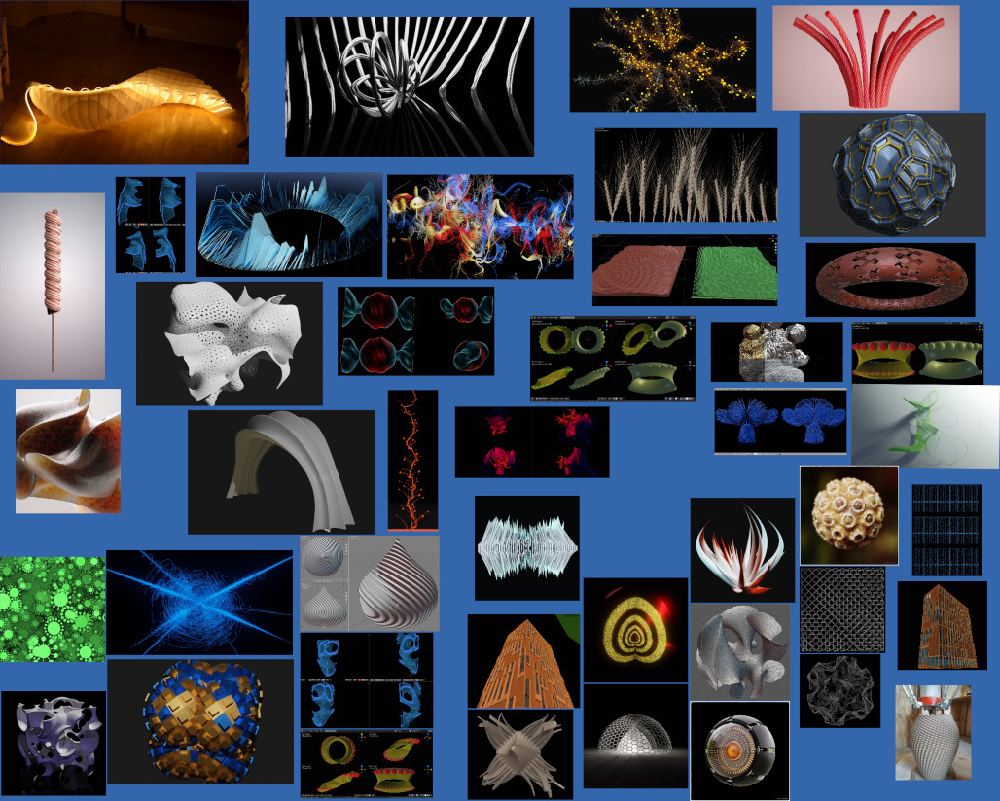
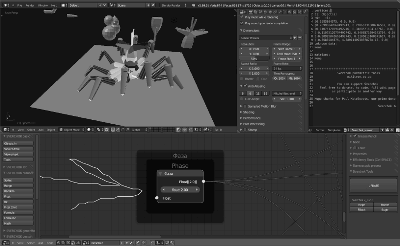
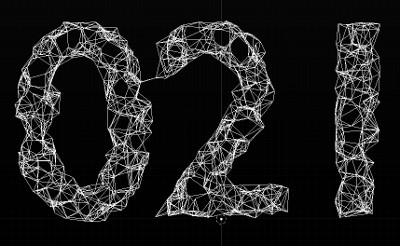
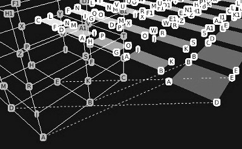
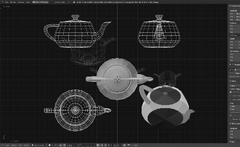

## Gallery
 
Here is album with artworks and screenshots of Sverchok from all of the Internet:    
(Make Smart tiles view and watch)    

    

## Divercity of authors   
Some of them permanently handle Sverchok pipeline, some from time to time, some once checked, anyway collected all artists:  
[Benny](https://twitter.com/BennyGovaerts)  
[zeffii](https://twitter.com/zeffii)  
[Sverchok3d](https://www.instagram.com/sverchok.3d/)  
[Jimmy](https://twitter.com/jimmygunawanapp)  
[Jimmy](https://www.instagram.com/enzyme69/)  
[Victor](https://twitter.com/VicDoval)  
[Illya](https://twitter.com/portnov9)  
[Alexandre](https://twitter.com/AlexandreRangel)  
[Maks](https://twitter.com/msurguy)  
[Erindale](https://twitter.com/erindale_xyz)  
[Erindale](https://www.instagram.com/e.r.i.n.d.a.l.e/)  
[ClayCodeCeramic](https://www.instagram.com/claycode_ceramic/)  
[3drwny](https://twitter.com/3drwny)  
[Sergey](https://twitter.com/SoluSerg)  
[Pixelumen1](https://twitter.com/Pixelumen1)  
[Pixelumen](https://www.instagram.com/pixelumen/)  
[Kukan](https://twitter.com/asahidari)  
[Kenjiro](https://twitter.com/ken26u_tw)  
[Bastian](https://www.instagram.com/bastiannjonas/)  
[Kronpano](https://www.instagram.com/kronpano/)  
   
[Sue](https://twitter.com/SueSuemejack)  
[Arthur](https://twitter.com/Shiftx_)  
[Johannes](https://twitter.com/johannes_wilde)  
[Eric](https://twitter.com/3d_eric)  
[Monnef](https://twitter.com/monnef)  
[Crossmod](https://twitter.com/crossm0d)  
[One](https://twitter.com/one_raw_artist)  
[Bluefox](https://twitter.com/bluefox_3d)  
[Jeff](https://www.instagram.com/jeffclermont/)  
[Giant](https://www.instagram.com/giantscience/)  
[Dr_formalyst](https://www.instagram.com/dr_formalyst/)  
[LiteLabelDesign](https://www.instagram.com/lite_label_design/)  
[Dra](https://www.instagram.com/dra_pankow/)  
[Arq.Gpj](https://www.instagram.com/arq.gpj/)  
[Artofriaz3d](https://www.instagram.com/artofriaz3d/)  
[Multidimentional](https://www.instagram.com/multidimensionalart/)  
[Fabianlabs](https://www.instagram.com/fabianlabs/)  
[Stefano](https://www.instagram.com/stefanofiloramo/)  
[Honga](https://www.instagram.com/hongablend/)  
[Ebube](https://www.instagram.com/ebube.jpg/)  
[4rvisuals](https://www.instagram.com/4r_visuals_/)  
[Dalede](https://www.instagram.com/daledesimone/)  
[rgon](https://www.instagram.com/_rgon_/)  
[3dsing](https://www.instagram.com/3dsinghvfx/)  
[Aerosoul](https://www.instagram.com/aero_soul_/)  
[Noam](https://www.instagram.com/noam3dart/)  
[Sorca](https://www.instagram.com/sorca.y/)  
[TheBuza](https://www.instagram.com/the.buza/)  
[Mlle](https://www.instagram.com/mlle_t/)  
[Avant](https://www.instagram.com/avantcontra/)  
[Onur](https://www.instagram.com/onur.comlekci/)  
[Nada](https://www.instagram.com/nada_alrahman/)  
[Ricardo](https://www.instagram.com/ricardomatiaspt/)  
[Nazzari](https://www.instagram.com/nazzari.laura/)  
[Jairo](https://www.instagram.com/jairojupas/)  
[Archi](https://www.instagram.com/archiartymusictects/)  
[P1xfx](https://www.instagram.com/p1xfx/)  
And so on...

<!--
Here is a collection of instructional layouts intended to get you started, clicking on any image will start to download the `.blend` file so you can load the layout in Blender and experiment:-->
<!--
<table class="sv_table_images">
  <tr>
    <td class="sv_table_img-elem">
        </td>
    <td class="sv_table_img-elem">
        </td>
    <td class="sv_table_img-elem">
        </td>
  </tr>
  <tr>
    <td class="sv_table_img-elem">
        </td>
    <td class="sv_table_img-elem">
        </td>
    <td class="sv_table_img-elem">
        </td>
  </tr>
  <tr>
    <td class="sv_table_img-elem">
        </td>
    <td class="sv_table_img-elem">
        </td>
    <td class="sv_table_img-elem">
        </td>
  </tr>
</table>
-->
