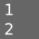

## Lessons

There is many lessons.

<table class="sv_table">
  <tr>
    <td class="sv_table-elem">
	<h3>BlenderSushi series on sverchok from Jimmy Gunawan</h3>
	
<ul>
	<li><a href='http://blendersushi.blogspot.ru/2014/01/sverchok-get-to-know.html'>Sverchok - get to know</a></li>
	<li><a href='http://blendersushi.blogspot.ru/2014/01/sverchok-connecting-dots.html'>Sverchok - connecting nodes</a></li>
	<li><a href='http://blendersushi.blogspot.ru/2014/01/sverchok-random-and-mask-list.html'>Sverchok - random and mask list</a></li>
	<li><a href='http://blendersushi.blogspot.ru/2014/01/sverchok-when-python-plays-with-cricket.html'>Sverchok - when python plays with cricket</a></li>
	<li><a href='http://blendersushi.blogspot.ru/2014/01/sverchok-seeing-matrix.html'>Sverchok - seen matrix / Сверчок - сеем матрицу</a></li>
	<li><a href='http://blendersushi.blogspot.ru/2014/01/sverchok-procedural-flower-and-leaf.html'>Sverchok - procedural flower and leaf</a></li>
	<li><a href='http://blendersushi.blogspot.ru/2014/01/sverchok-revisiting-procedural-stacking.html'>Sverchok - revisiting procedural stacking</a></li>
	<li><a href='http://blendersushi.blogspot.ru/2014/01/sverchok-basic-of-procedural-city.html'>Sverchok - basic of procedural city</a></li>
	<li><a href='http://blendersushi.blogspot.com.au/2014/01/sverchok-in-between-blends.html'>Sverchok - in between blends</a></li>
	<li><a href='http://blendersushi.blogspot.ru/2014/01/sverchok-sweep-swipe-swoop.html'>Sverchok - sweep-swipe-swoop</a></li>
	<li><a href='http://blendersushi.blogspot.ru/2014/04/sverchok-embracing-art-of-parametric.html'>Sverchok - Embracing The Art of Parametric Creation In Blender</a></li>
	<li><a href='http://blendersushi.blogspot.com/2014/04/sverchok-parametric-snippets-1.html'>Sverchok - parametric snippets 1</a></li>
	<li><a href='http://blendersushi.blogspot.com/2014/04/sverchok-parametric-design-study-of.html'>Sverchok - parametric design study of</a></li>
	<li><a href='http://blendersushi.blogspot.com/2014/05/sverchok-parametric-snippets-2.html'>Sverchok - parametric snippets 2</a></li>
	<li><a href='http://blendersushi.blogspot.com/2014/05/sverchok-in-between-strands-of-threads.html'>Sverchok - in between strands of threads</a></li>
	<li><a href='http://blendersushi.blogspot.com/2014/05/sverchok-procedural-city-wip-1.html'>Sverchok - procedural city wip</a></li>
	<li><a href='http://blendersushi.blogspot.com/2014/05/sverchok-parametric-snippet-3.html'>Sverchok - parametric snippets 3</a></li>
	<li><a href='http://blendersushi.blogspot.com/2014/06/sverchok-parametric-snippets-4.html'>Sverchok - parametric snippets 4</a></li>
	<li><a href='http://blendersushi.blogspot.com/2014/06/sverchok-parametric-snippet-5.html'>Sverchok - parametric snippets 5</a></li>
	<li><a href='http://blendersushi.blogspot.com/2014/06/sverchok-basic-of-semi-procedural.html'>Sverchok - basic of semi procedural</a></li>
	<li><a href='http://blendersushi.blogspot.com/2014/06/sverchok-flower-and-snake_474.html'>Sverchok - flower and snake (+18)</a></li>
	<li><a href='http://blendersushi.blogspot.com/2014/06/sverchok-parametric-snippet-6.html'>Sverchok - parametric snippets 6</a></li>
	<li><a href='http://blendersushi.blogspot.com/2014/06/sverchok-parametric-snippet-7.html'>Sverchok - parametric snippets 7</a></li>
	<li><a href='http://blendersushi.blogspot.com/2014/07/sverchok-parametric-snippet-8.html'>Sverchok - parametric snippets 8</a></li>
	<li><a href='http://blendersushi.blogspot.com/2014/07/sverchok-case-of-matryoshka-dolls.html'>Sverchok - case of matryoshka dolls</a></li>
	<li><a href='http://blendersushi.blogspot.com/2014/07/sverchok-parametric-snippet-9.html'>Sverchok - parametric snippets 9</a></li>
	</ul>
	 
	
	<h3>Luis Chavez. Sverchok+Unreal Engine 4.</h3>
	<ul>
	<li><a href='http://www.timefirevr.com/2014/10/13/sverchok-unreal-engine-4-part-1/'>From Sverchok to UE4 1</a></li>
	<li><a href='http://www.timefirevr.com/2014/10/14/sverchok-unreal-engine-4-part-2/'>From Sverchok to UE4 2</a></li>
	<li><a href='http://www.timefirevr.com/2014/10/15/sverchok-unreal-engine-4-part-3/'>From Sverchok to UE4 3</a></li>
	<li><a href='http://www.timefirevr.com/2014/10/15/sverchok-unreal-engine-4-part-4/'>From Sverchok to UE4 4</a></li>
	<li><a href='http://www.timefirevr.com/2014/10/15/sverchok-unreal-engine-bonus/'>Bonus</a></li>
	</ul>
	 
	<h3>Elfnor. Work with his honor Matrix.</h3>
	<ul>
	<li><a href='http://elfnor.com/simple-sverchok-01-centers-polygons.html'>Matrices on polygons 1</a></li>
	<li><a href='http://elfnor.com/simple-sverchok-02-matrix-deform.html'>Matrices on polygons 2</a></li>
	<li><a href='http://elfnor.com/simple-sverchok-03-slope-dependent-trees.html'>Matrices on polygons 3</a></li>
	</ul>
	 
	
    </td>
    <td class="sv_table-elem">
	<h3>Original lessons in Russian</h3>
	<ul>
	<li><a href='http://nikitron.cc.ua/Sverchok_man_00.html'>Урок 00. Installation.</a></li>
	<li><a href='http://nikitron.cc.ua/Sverchok_man_01.html'>Урок 01. Sverchok and line. Way of Sverchok.</a></li>
	<li><a href='http://nikitron.cc.ua/Sverchok_man_02.html'>Урок 02. Data structure.</a></li>
	<li><a href='http://nikitron.cc.ua/Sverchok_man_03.html'>Урок 03. Nodes cards.</a></li>
	<li><a href='http://nikitron.cc.ua/Sverchok_man_04.html'>Урок 04. Joining meshes.</a></li>
	<li><a href='http://nikitron.cc.ua/Sverchok_stadium.html'>Урок 05. Lenin' stadium.</a></li>
	<li><a href='http://nikitron.cc.ua/Sverchok_table.html'>Урок 06. !!! Tables in reality.</a></li>
	<li><a href='http://nikitron.cc.ua/Sverchok_man_07.html'>Урок 07. Scripted node, easy.</a></li>
	<li><a href='http://nikitron.cc.ua/Sverchok_man_08.html'>Урок 08. Shell - splines interpolation.</a></li>
	<li><a href='http://nikitron.cc.ua/Sverchok_man_09.html'>Урок 09. Truss construction.</a></li>
	<li><a href='http://nikitron.cc.ua/Sverchok_man_10_theme.html'>Урок 10. Interface.</a></li>
	<li><a href="http://nikitron.cc.ua/Sverchok_man_11_profile.html">Урок 11. Profile node.</a></li>
	<li><a href="http://nikitron.cc.ua/Sverchok_man_12_timing.html">Урок 12. Debugging.</a></li>
	<li><a href="http://nikitron.cc.ua/Sverchok_man_13_menu.html">Урок 13. Menu.</a></li>
	<li><a href="http://nikitron.cc.ua/Sverchok_man_14_IO.html">Урок 14. Import/Export layouts.</a></li>
	</ul>
	 
	<h3>Dealga aka Zeffii blog(s) lessons</h3>
	<ul>
	<li><a href='http://blenderscripting.blogspot.com/2014/08/sverchok-basics.html'>Sverchok the basics, recommend</a></li>
	<li><a href='http://blenderpython.tumblr.com/post/91852059604/sverchok-a-brief-introduction-to-parametric-modelling'>How to make bridge laing bed</a></li>
	<li><a href='http://blenderpython.tumblr.com/post/92143781744/sverchok-callisthenics-set-1-primitive-fish'>How to fish. process is main here</a></li>
	<li><a href='http://blenderpython.tumblr.com/post/93016276989/two-circles-verts-and-edges'>How to make Гиркин tower from circle step-by-step</a></li>
	</ul>
	 
	<h3>Places</h3>
	<ul>
	<li><a href="http://www.blenderartists.org/forum/showthread.php?272679-Addon-WIP-Sverchok-parametric-tool-for-architects/">Blenderartist thread</a></li>
	<li><a href='https://vk.com/club35076122'>Vk</a></li>
	<li><a href='https://plus.google.com/communities/113245231013159497850'>G+</a></li>
	<li><a href='http://blender.stackexchange.com'>Here ask question with sverchok remaining</a></li>
	<li><a href='http://doraemonarchitecture.tumblr.com/'>Doraemon's blog</a></li>
	</ul>

   </td>
   </tr>
   </table>