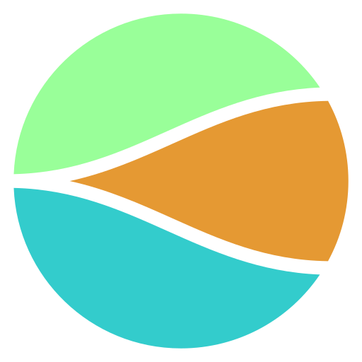

<h1 align="center">СВеРЧОК (Система векторного рабочего черчения и объёмного конструирования)</h1>

## По-русски

[EN](https://github.com/nortikin/sverchok/blob/master/README.md)   
**Дополнение к**: [Blender](http://blender.org)  версия *2.80* и выше. Для версии *2.79*, см. [специальную инструкцию по установке](https://github.com/nortikin/sverchok/wiki/Sverchok-for-Blender-2.79-installation). 

**Текущая версия**: Смотри настройки Сверчка или панель   
**Лицензия**: [GPL3](http://www.gnu.org/licenses/quick-guide-gplv3.html)   
**Требования**: Хотя Сверчок в основном самостоятельный, ему нужен Python 3.6+ и numpy, они оба присутствуют в Blender (предскомпилированные бинарники), и от Вас не требуется дополнительных действий, мы добавили не обязательные узлы, использующие несколько дополнительных библиотек; если они у вас есть, то будет доступно большое количество дополнительных узлов. См. [wiki-страницу](https://github.com/nortikin/sverchok/wiki/Dependencies) со списком таких зависимостей и инструкциями по их установке.    
**Руководство**: [Английский](http://nikitron.cc.ua/sverch/html/main.html) - Введение в Сверчка из трёх уроков, и документация почти на все узлы. Если что-либо не ясно или не найдено, сообщите [по адресу](https://github.com/nortikin/sverchok/issues), вы можете помочь нам актуализировать уроки. 

  
### Описание
Сверчок - мощный инструмент для архитектора, позволяющий визуально программировать узлами. 
Программирование сетки и геометрии состоит из "кирпичей":  

  - списков Векторов являющих собой координаты вершин  
  - списки групп индексов представляющие рёбра и грани и другие данные  
  - матрицы (удобный и понятный способ изменения положения-масштаба-поворота)  
  - кривые - математические кривые  
  - поверхности - математические поверхности  
  - скалярные и векторные поля  
  - твёрдые тела, для их использования вам нужно установить библиотеки Фрикада  
  - инсоляция и рассчёт влияния солнца  
  

### Возможности
Более 600 узлов вам помогут создать и изменять геометрию. А сочетания узлов помогут вам:

  - делать параметрические конструкции  
  - легко менять параметры слайдерами и формулами  
  - Супер-узлы: Profile parametric, UVconnect, Generetive art, Mesh expression, Proportion edit, Wafel, Adaptive Poligons (tissue vectorized), Adaptive edges, ExecNodeMod, Vector Interpolation series of nodes, List manipulators, CSG Boolean, Bmesh ops,Bmesh props, и т.д.    
  - делать сечения, выдавливания, другие изменения с гибким параметризованым и векторизованым набором узловых инструментов   
  - считать площади, объём и прочее  
  - анализировать геометрию  
  - выводить данные в таблицы CSV или импортировать из CSV прямо в Сверчка
  - создавать векторные и скалярные поля  
  - твёрдотельное моделирование  
  - обмен форматами brep/NURBS/IFC  
  - Подготовка чертежей SVG формата  
  - Просчёт инсоляции и радиации  
  - визуализировать данные  
  - даже написать свой узел на питоне, используя Scripted node  
  - делать свои дополнения к блендеру раскладкой узлов и затем пользоваться ими в окне 3М вида при помощи панели инструментов Сверчка для 3М окна  
  - доступ к API (bpy) при помощи узлов _Set_ и _Get_  
  - обновлять сверчка одной кнопкой  
  - использовать генетический алгоритм  
  - и даже больше   

### Установка
Установите как обычный адон к блендеру.  
  
-  _Установка из пользовательских настроек_  
   Скачать Сверчка с github  
   User Preferences > Addons > install from file >   выбрать zip-архив > активировать Сверчка  
   Подтвердите выбор в файле startup.blend используя `Ctrl + U` и `Save User Settings`в меню Addons.  

-  _Обновление Сверчка_   
   Используйте кнопку `Check for new version` в панели Сверчка в раскладке узлов (`N` чтобы вызвать). 
   Нажмите кнопку `Update Sverchok` там же.  
   Нажмите потом `F8` чтобы перезагрузить дополнения блендера. Должна поменяться версия.  

-  _Дополнительно_  
   Сверчок имеет большие скрытые возможности и много дополнительных узлов. Они раскрываются с установкой дополнительных python библиотек через установщик pip:  
   - scipy  
   - marching cubes  
   - geomdl   
   - SciKit-image   
   - shapely  
   - circlify  
   - freecadpython3lib   
   - ladybug  
   [описание здесь](https://github.com/nortikin/sverchok/wiki/Dependencies)

### Известные ошибки установки
Не установилось? Список причин [тыц](http://nikitron.cc.ua/sverch/html/installation.html). Если вашей ошибки там нет - пишите письма.  
Если вы устанавливаете из архива типа release, опасайтесь имени папки типа `sverchok-master.x.y.z`, в таком случае переименуйте её в `sverchok-master`, потому что имена папок с точками не читаются в именах пакетов питона.   
При установке из пользовательских настроек, при получении ошибки - закрыть блендер и снова активировать Сверчка, всё до сохранения настроек блендера.  
Также если вы обновляете Сверчка с кнопкой автообновления, будьте осторожны, в связи с названием папки, блендер может не подхватить её, следуйте указаниям [здесь](https://github.com/nortikin/sverchok/issues/669)   

### Контакты и разработчики
Домашняя страница: [Домой](http://nikitron.cc.ua/sverchok_ru.html)  
Разработчики: 
-  Недовизин Александр;  
-  Городецкий Никита;  
-  Инг Линус;  
-  Жименез Агустин; 
-  МакАрдле Деальга;  
-  Воробьёв Константин;  
-  Портнов Илья;  
-  Ховик Элеонора;  
-  Пердан Вальтер;    
-  Мариус Георгий;     
-  Солуянов Сергей;       
-  Прытов Иван;      
-  Доваль Виктор;   
-  Маулт Дион;  
-  Зомпарелли Алессандро    

Email: sverchok-b3d@yandex.ru  

