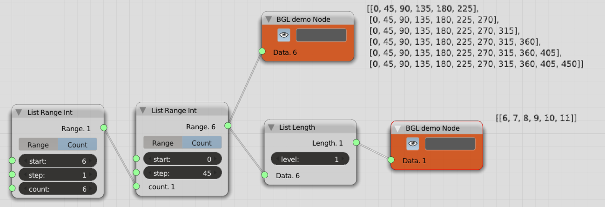

List Length
===========

Functionality
-------------

The Node equivalent of the Python ``len()`` function. The length is inspected at the Level needed.

Inputs
------

Takes any kind of data.

Parameters
----------

**Level:** Set the level at which to observe the List.

Outputs
-------

Depends on incoming data and can be nested. Level 0 is top level (totally zoomed out), higher levels get more granular (zooming in) until no higher level is found (atomic). The length of the most atomic level will be 1, for instance single ints or float or characters. The output will reflect the nestedness of the incoming data.

Examples
--------

Often a few experiments with input hooked-up to a debug node will make the exact working of this Node instantly clearer than any explanation. 

.. image:: ListLengthDemo1.PNG
