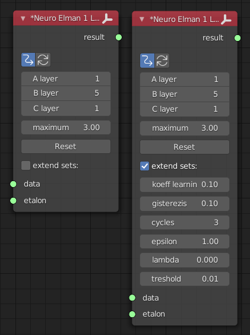
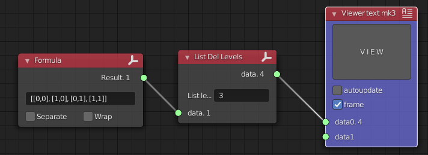
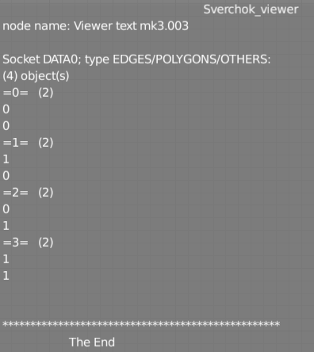
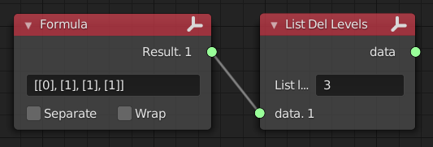
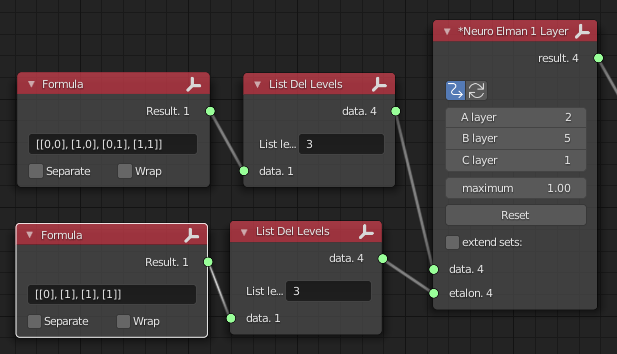
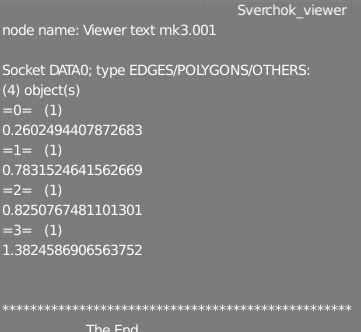
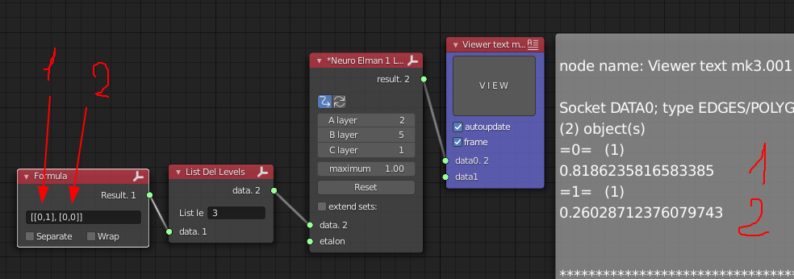

# Neuro Elman 1 Layer

<h2>Functionality</h2>

Layer 1 neuron network with studying. With Inputs and Outputs.
You should study network on data. After studying use node on your tree.

<a href="https://kpfu.ru/staff_files/F1493580427/NejronGafGal.pdf">Algorythm description</a>

Tune node before use. Mandatory props first. Additional props can be passed.
After tuning and connecting links go to study.
Every update will teach your node.
You can press update and wait some time.

<u>Data shape</u>: 
[obj1, obj2, obj3, ...] 
obj = [...] 
[[...], [...], [...], ...] 
Object levels 2 levels. Every object contain data for one step of srudying. 
Prepare data that way and link to input. To <b>etalon</b> send same objects count. Output will contain same objects count.

<h2>Category</h2>
Logic -> Neuro Elman 1 Layer

<h2>Inputs</h2>
<ul>
<li><b>data</b> - input data</li>
<li><b>etalon</b> - expected data</li>
</ul>

<h2>Outputs</h2>
<ul>
<li><b>result</b> - resulting data</li>
</ul>

<h2>Parameters</h2>
<ul>
<li><b>A layer</b> - First layer neurons count, same as object count</li>
<li><b>B layer</b> - Second layer neurons count, inner layer</li>
<li><b>C layer</b> - Third layer neurons count, Equal to objects count on output</li>
<li><b>maximum</b> - Maximum possible values, meaning to be used on node</li>
<li><b>koeff learning</b> - node learning tempo (change w/o fear)</li>
<li><b>gisterezis</b> - scheduled to set thresholds for signal processing (not in use yet)</li>
<li><b>cycles</b> - Loops count to study by one pass</li>
<li><b>epsilon</b> - the susceptibility of the node study</li>
<li><b>lambda</b> - weight coefficients changing's step</li>
<li><b>treshold</b> - Threshold preserve retraining</li>
<li><b>Reset</b> (button) - reset all coeffitients</li>
</ul>

<h2>Usage</h2>
<strong>Task statement</strong>

Please, study for XOR operation: 
[1, 1] = [1] 
[1, 0] = [1] 
[0, 1] = [1] 
[0, 0] = [0] 

<strong>Preparations</strong>

 Same with expected data 

<strong>Node preparations</strong>
<ul>
<li><b>A layer</b> - Set value 2, because inputs are pairs</li>
<li><b>B layer</b> - Let it be 5, but can be any (experiment here)</li>
<li><b>C layer</b> - Setting 1, because output have to be one number</li>
</ul>

 
Running learning and waiting. Interrupt Studying. I had have that result:
 

Compare result: 

 

