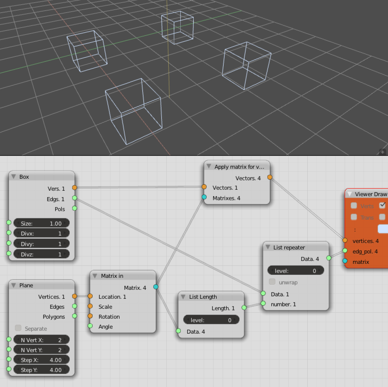

Matrix Apply
============

Functionality
-------------

Applies a Transform Matrix to a list or nested lists of vectors (and therefore vertices)

Inputs
------

+----------+-----------------------------------------------------------------------------+
| Inputs   | Description                                                                 |
+==========+=============================================================================+
| Vectors  | Represents vertices or intermediate vectors used for further vector math    |
+----------+-----------------------------------------------------------------------------+
| Matrices | One or more, never empty                                                    |
+----------+-----------------------------------------------------------------------------+

Outputs
-------

Nested list of vectors / vertices, matching the number nested incoming *matrices*.

Examples
--------

Notes
-------

The ``update`` function is outdated, functionally this is of no relevance to users but we should change it for future compatibility.