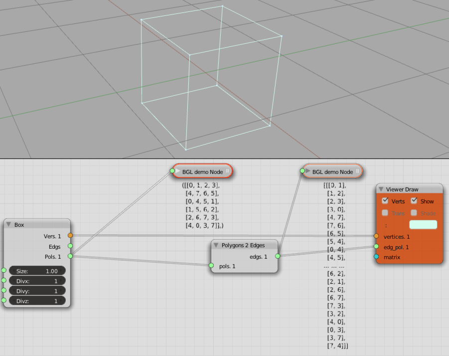

Polygons to Edges
=================

Functionality
-------------

Each polygon is defined by a closed chain of vertices which form the edges of the polygon. The edges of each polygon can be extracted. If a polygon is defined by a list of vertex indices (keys) as ``[3,5,11,23]`` then automatically the edge keys can be inferred as ``[[3,5],[5,11],[11,23],[23,3]]``. Note here that the last key closes the edge loop and reconnects with the first key in the sequence.

Input & Output
--------------

+--------+-------+-------------------------------------------+
| socket | name  | Description                               |
+========+=======+===========================================+    
| input  | pols  | Polygons                                  |
+--------+-------+-------------------------------------------+
| output | edges | The edges from which the polygon is built |
+--------+-------+-------------------------------------------+

Examples
--------

Notes
-------

If you feed this node geometry and are not getting the expected output, try a subset of the input geometry and hook
the output up to a *debug node*. Seeing what the output really is helps get an understanding for how this Node has interpreted the data. Also view the incoming data to see if it's what you think it is, perhaps it has unexpected extra nesting or wrapping.

Doesn't currently work on Plane Generator, or any generator which expresses key lists using *tuples*.

.. image:: Poly2EdgeDemo2.PNG
