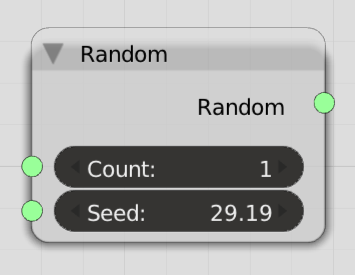

Random
======

Functionality
-------------

Produces a list of random numbers from a seed value.

Inputs & Parameters
-------------------

+------------+-------------------------------------------------------------------------+
| Parameters | Description                                                             |
+============+=========================================================================+
| Count      | Number of random numbers to spit out                                    |
+------------+-------------------------------------------------------------------------+
| Seed       | Accepts float values, they are hashed into *Integers* internally.       |
+------------+-------------------------------------------------------------------------+

What's a Seed? Read the `Python docs here <https://docs.python.org/3.4/library/random.html>`_

Outputs
-------

A list, or nested lists.

Examples
--------

.. image:: NumberRandomDemo2.PNG

Notes
-----

Providing a float values as a Seed parameter may be unconventional, if you are uncomfortable with it you 
could place a *FloatToInt* node before the Seed parameter. We may add more Random Nodes in future.
