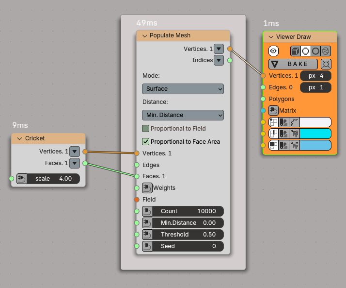
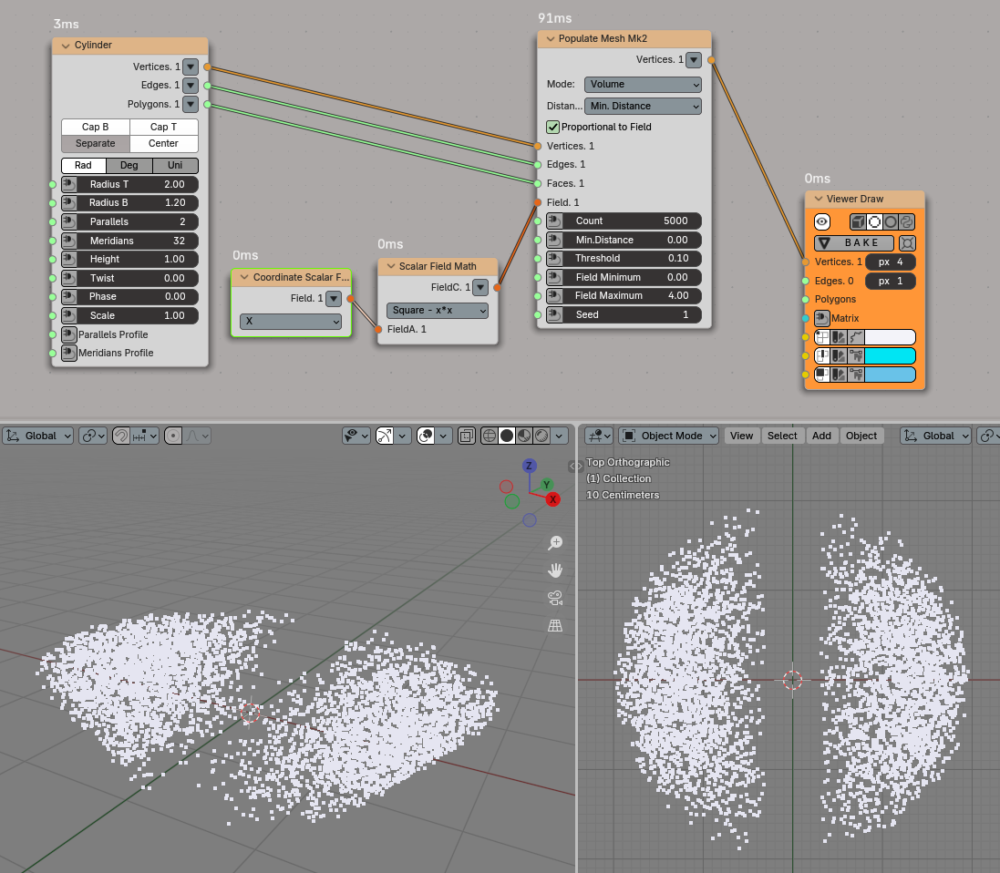
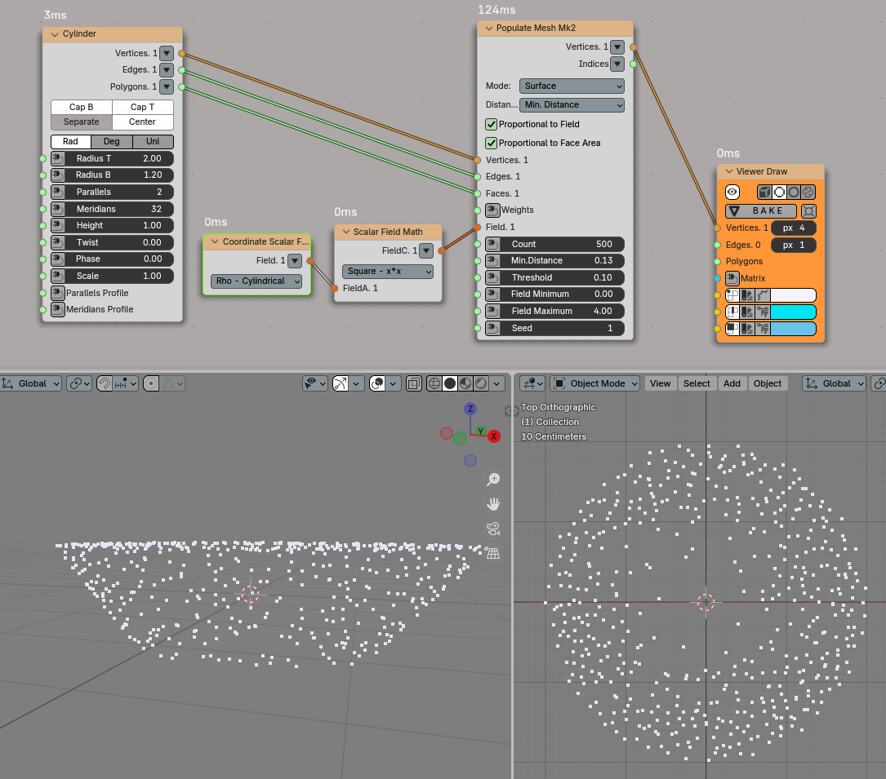
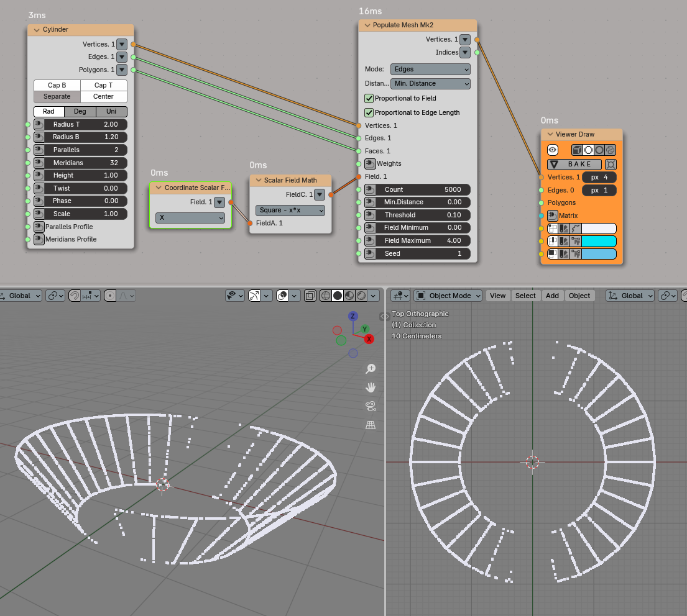
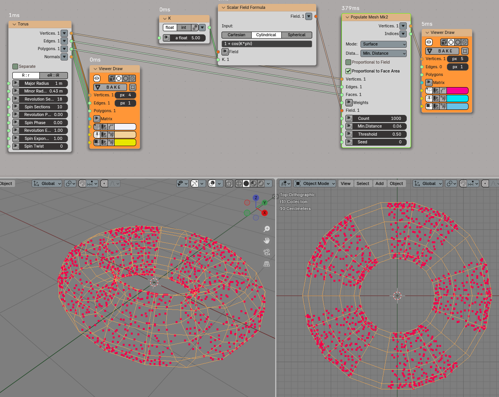
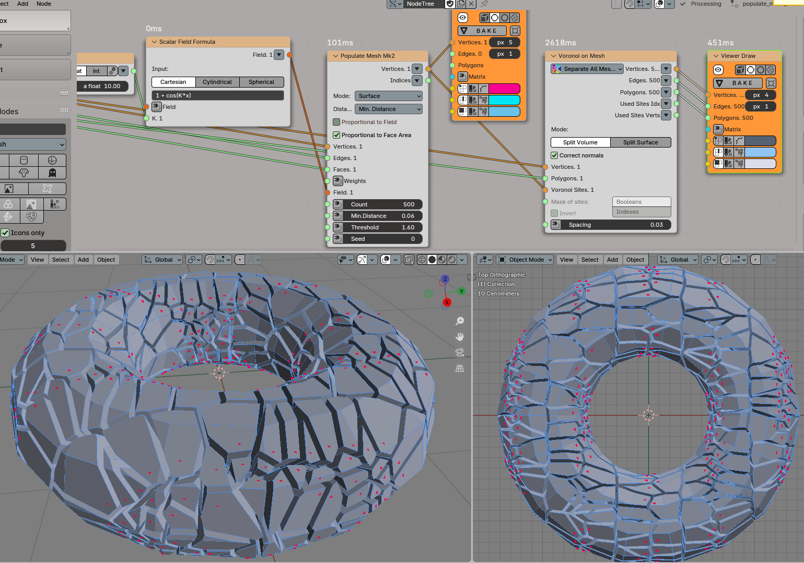

Populate Mesh
=============

Functionality
-------------

The node distributes points on given mesh.

.. image:: https://user-images.githubusercontent.com/14288520/201531076-d2b9e049-b229-4065-acbe-a9c735364e3c.png
  :target: https://user-images.githubusercontent.com/14288520/201531076-d2b9e049-b229-4065-acbe-a9c735364e3c.png

Volume:

.. image:: https://user-images.githubusercontent.com/14288520/201530858-6d55519a-b06d-4a90-a15d-a564d7c9e5e6.gif
  :target: https://user-images.githubusercontent.com/14288520/201530858-6d55519a-b06d-4a90-a15d-a564d7c9e5e6.gif

Category
--------

Spatial -> Populate Mesh

Inputs
------

* **Vertices**. Vertices of given mesh(es). This input is mandatory.
* **Edges**. Edges of given mesh(es).
* **Faces**. Faces of given mesh(es). This input is mandatory.
* **Weights**. This input is optional. Available only in **Surface** and
  **Edges** modes. This input is supposed to contain one value per face or
  edge. The less value the less number of vertices generates on current face.
  Values lessen then 0 will be changed to 0. This input can be used as mask.
  Just assign 0 values to faces on which there is no need in generation points.
* **Field**. The scalar field defining the distribution of generated points. If
  this input is not connected, the node will generate evenly distributed
  points. This input is mandatory, if **Proportional to Field** parameter is checked.
* **Count**. The number of points to be generated. The default value is 50.
* **MinDistance**. This input is available only when **Distance** parameter is
  set to **Min. Distance**. Minimum allowable distance between generated
  points. If set to zero, there will be no restriction on distance between
  points. Default value is 0.
* **RadiusField**. This input is available and mandatory only when **Distance**
  parameter is set to **Radius Field**. The scalar field, which defines radius
  of free sphere around any generated point.
* **Threshold**. Threshold value: the node will not generate points in areas
  where the value of scalar field is less than this value. The default value is
  0.5.
* **Field Minimum**. Minimum value of scalar field reached within the mesh.
  This input is used to define the probability of vertices generation at
  certain points. This input is only available when the **Proportional to
  Field** parameter is checked. The default value is 0.0.
* **Field Maximum**. Maximum value of scalar field reached within mesh.
  This input is used to define the probability of vertices generation at
  certain points. This input is only available when the **Proportional to Field**
  parameter is checked. The default value is 1.0.
* **Seed**. Random seed. The default value is 0.

Parameters
----------

This node has the following parameters:

* **Mode**. This defines where the points will be generated. The available options are:

  * **Volume**. The points will be generated inside the mesh.
  * **Surface**. The points will be generated on the surface of the mesh.
  * **Edges**. The points will be generated on the edges of the mesh.

  The default value is **Volume**.
* **Distance**. This defines how minimum distance between generated points is
  defined. The available options are:

   * **Min. Distance**. The user provides minimum distance between any two
     points in the **MinDistance** input.
   * **RadiusField**. The user defines a radius of a sphere that should be
     empty around each generated point, by providing a scalar field in the
     **RadiusField** input. The node makes sure that these spheres will not
     intersect.

   The default value is **Min. Distance**.
* **Proportional to Field**. If checked, then the points density will be distributed
  proportionally to the values of scalar field. Otherwise, the points will be
  uniformly distributed in the area where the value of scalar field exceeds
  threshold. Unchecked by default.
* **Proportional to Face Area / Edge Length**. This parameter is available only
  in **Surface** and **Edges** modes. If checked then the points density will
  be distributed proportionally to areas of mesh faces (in **Surface** mode) or
  length of mesh edges (in **Edges** mode). Checked by default.
* **Random Radius**. This parameter is available only when **Distance**
  parameter is set to **RadiusField**. If checked, then radiuses of empty
  spheres will be generated randomly, by using uniform distribution between 0
  (zero) and the value defined by the scalar field provided in the
  **RadiusField** input. Unchecked by default.

Outputs
-------

This node has the following output:

* **Vertices**. Generated vertices.
* **Indices**. This output is available only in **Surface** and **Edges**
  modes. For each generated point, it contains the index of mesh face or edge
  the point was generated on.
* **Radiuses**. This output is available only when **Distance** parameter is
  set to **RadiusField**. For each generated point, this output contains the
  radius of free space around the point.

Examples of Usage
-----------------

Points on the surface of cricket model:

.. image:: https://user-images.githubusercontent.com/14288520/201532606-a738a7b3-c303-44d6-ab81-3f49b0c11468.gif
  :target: https://user-images.githubusercontent.com/14288520/201532606-a738a7b3-c303-44d6-ab81-3f49b0c11468.gif

Points within mesh volume, with distribution controlled by scalar field:

Points on mesh surface, with distribution controlled by scalar field:

Points on mesh edges, with distribution controlled by scalar field:

Points on mesh surface, with distribution controlled by scalar field:

Voronoi built from mesh, with sites distribution controlled by scalar field:

