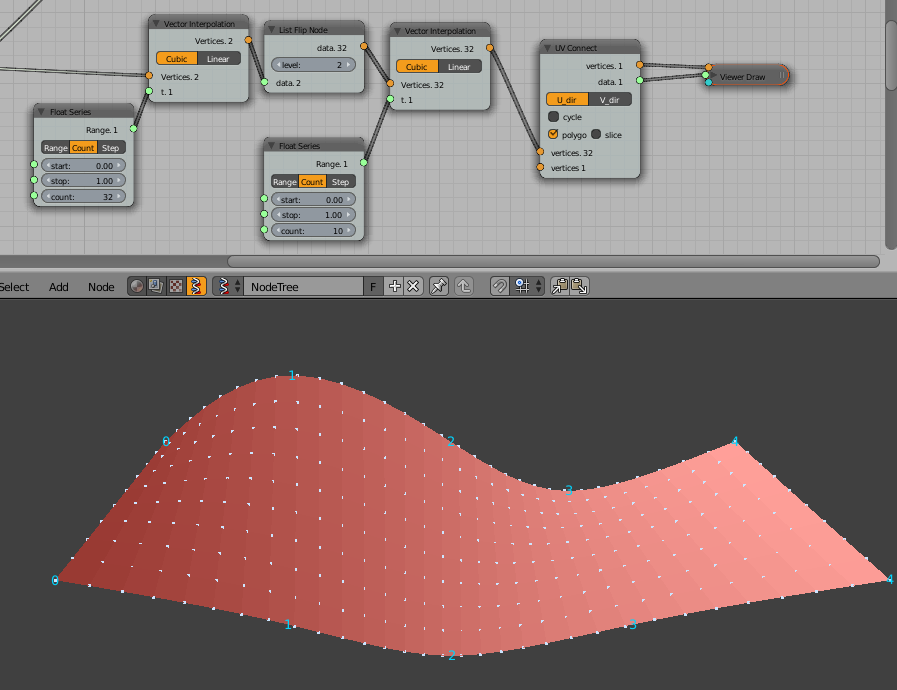

Vector Interpolation
====================
Functionality
-------------

Performs linear or cubic spline interpolation based on input points by creating a function ``x,y,z = f(t)`` with ``t=[0,1]``. The interpolation is based on the distance between the input points.

Input & Output
--------------

+--------+----------+-------------------------------------------+
| socket | name     | Description                               |
+========+==========+===========================================+    
| input  | Vertices | Points to interpolate                     |
+--------+----------+-------------------------------------------+
| input  | t        | Value to interpolate                      |
+--------+----------+-------------------------------------------+
| output | Vertices | Interpolated points                       |
+--------+----------+-------------------------------------------+

Examples
--------
.. image:: interpol-simple.png
Sine interpolated from 5 points. The input points are shown with numbers. 

An interpolated surface between sine and cosine.

Notes
-------

The node doesn't extrapolate. Values outside of ``[0, 1]`` are ignored.
It doesn't support cyclic interpolation (TODO).
