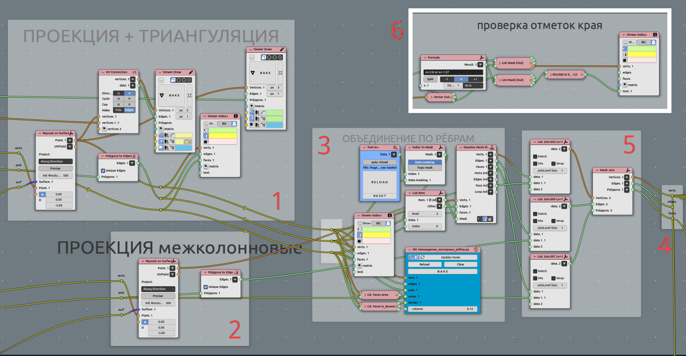

*********************************
Celling 03. Flattening and offset
*********************************

Subject
~~~~~~~

Importing initial shape (railing lines) for celling, checking of consistency

Node Tree
---------

|image0|

1. **Import geometry**:

|image1|

  1. ObjectGet from scene - Small area' boundary with incet faces at 0.003 m value;
      1.1. Crop mesh (3) with that boundary;
  2. ObjectGet from scene - Large area' boundary with incet faces at 0.003 m value;
      2.1. Crop mesh (3) with that boundary;
  3. Getting Rhomb Pattern manually created;
  4. Attempt to create pattern parametrically, it fails only because simplicity of initial pattern to be manual;
  5. Separately boundary for between-columns spaces;
  6. Lines to manually determinecorner bended plates. It is diagonal for rhomb;

2. **Making surface**:

|image2|

  1. ObjectGet from scene - lower and ipper line for surface construction$
  2. Making surface. In some cases needed natural paramereisation.

  That step convenient to be in math surface, but far there we will go mostly mesh.

3. **Projecting pattern to surface**:

|image3|

  1. Raycast on surface main area;
  2. Raycast on surface space between columns;
  3. Most intriguing part - MANUAL angustment. Look for third part point 4. Dissolve;
  4. Joining all geometry to one;
  5. Convenient to make such reroute points (NodesMenu->layout->Reroute);
  6. Additionallychecking all vertical dimentions to match initial line. We are using manually created lines in scene to adjust that Z-values. Maybe in some cases this checkout should be after flattening stage.

4. **Separating bended corner plates**:

|image4|

  1. Raycast pattern on surface corner area (edges);
  2. Section matrices to separate left and right plate sides;
  3. Select corner faces (not edges);
  4. Bisect and separate left and right sides;
  5. Join mesh;
  6. Drop and flatten left and right sides separately;

5. **Flattening every plate**:

6. **Sew corner splitted plates**:

7. **Tipisation of plates**:

8. **Drop plates to layout**:

9. **Testing and gathering**:

10. **Output**:

.. |image0| image:: celling_02_images/00_tree.png

.. |image1| image:: celling_02_images/01_tree.png

.. |image2| image:: celling_02_images/02_tree.png

.. |image4| image:: celling_02_images/04_tree.png
